# NHANES笔记

## 1999-2000

### 1、字段

#### 纬度

数据纬度，有9965个受试者，有144个变量

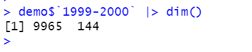


#### 变量名与标签

有36个变量，104个权重。

```
demo$`1999-2000` |> colnames_labels(T) |> View()
```

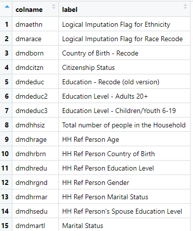


#### seqn

受访者序列号

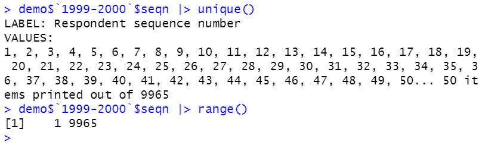


#### **sddsrvyr** 

表示调查发布编码，1999-2000数据的编码是1，2001-2002的编码是2，其它以此类推。sdd的意思是语义数据字典（**S**emantic **D**ata **D**ictionary），srvyr表示调查发布（**s**u**rvy** **r**elease)

9965名受试者全部发布，无删失。

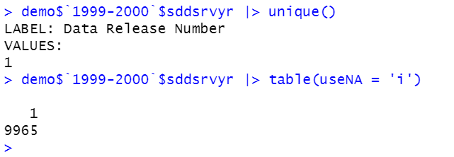

#### **ridstatr** 

  表示受试者的状态，1表示仅仅进行了家庭访谈interview，2表示进行了访谈interview和电话回访（mobile examination center (MEC)）

  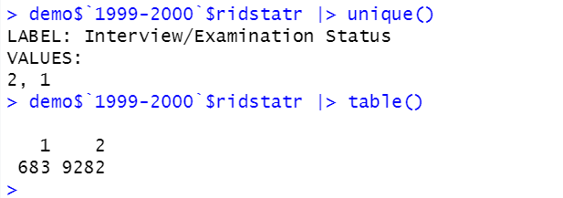

#### **ridexmon** 
表示测试的6个月时段（**ex**amination **mon**th）：1表示11月1日到4月30日，2表示5月1日到10月31日。

  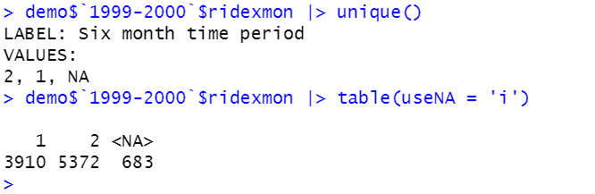

#### riagendr

表示性别，1表示男性，2表示女性

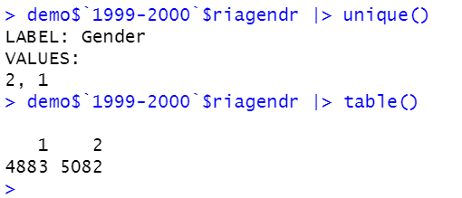

#### ridageyr

表示受试者的年龄（以年为单位），对于 1 至 84 岁的人，年龄按岁数报告。对于老年人，年龄最高编码为 85 岁，以降低披露风险。所有 85 岁及以上的成年人的 ridageyr 值为“85”。在 NHANES 1999-2000 中，85 岁及以上参与者的加权平均年龄为 88 岁。

  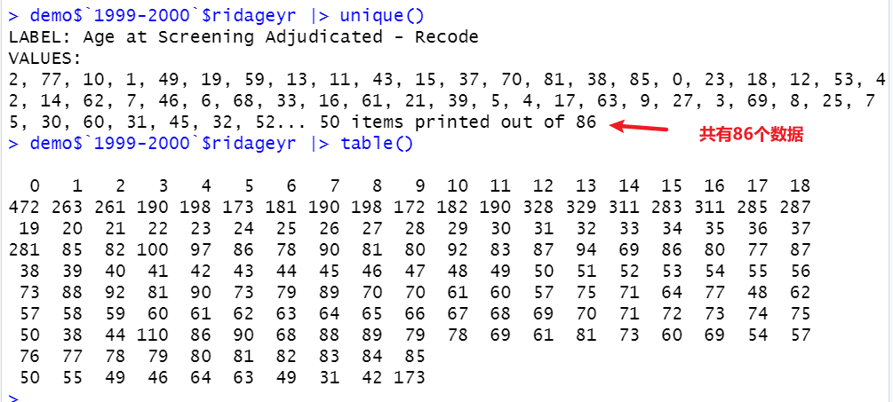

  年龄分布

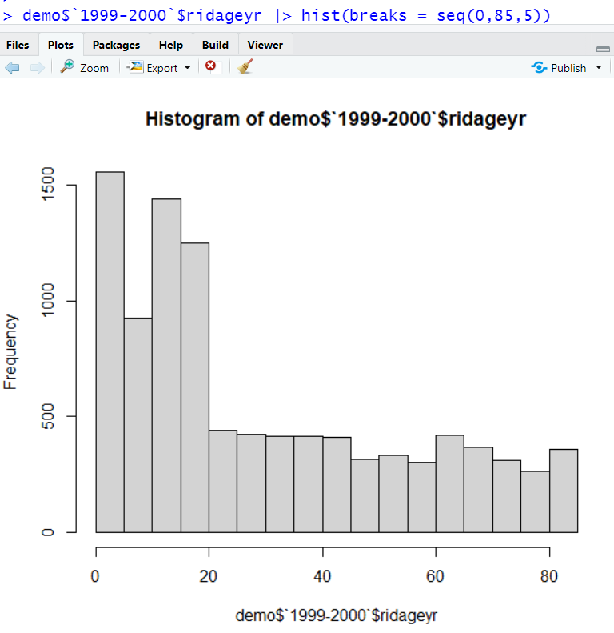

#### ridagemn 
表示受试者的年龄，以月未单位。


#### ridageex

表示在电话随访（**ex**amination）时候的年龄，以月为单位。

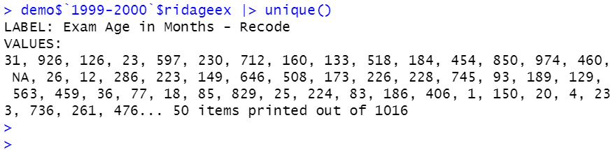

#### ridreth1

表示种族信息，

| 代码或值 |        值说明         | 数数 | 累计 |
| :------: | :-------------------: | :--: | :--: |
|    1     |    墨西哥裔美国人     | 3393 | 3393 |
|    2     |     其他西班牙裔      | 589  | 3982 |
|    3     |    非西班牙裔白人     | 3367 | 7349 |
|    4     |    非西班牙裔黑人     | 2228 | 9577 |
|    5     | 其他种族 - 包括多种族 | 388  | 9965 |
|    .     |        丢失的         |  0   | 9965 |

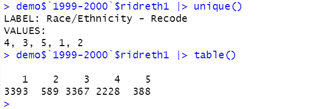


#### ridreth2

表示种族信息，可以连接到NHANES III数据中，在该数据中的非西班牙裔可以进一步分成非西班牙裔白人和非西班牙裔黑人。


| 代码或值 |        值说明         | 数数 | 累计 |
| :------: | :-------------------: | :--: | :--: |
|    1     |    非西班牙裔白人     | 3423 | 3423 |
|    2     |    非西班牙裔黑人     | 2273 | 5696 |
|    3     |    墨西哥裔美国人     | 3393 | 9089 |
|    4     | 其他种族 - 包括多种族 | 287  | 9376 |
|    5     |     其他西班牙裔      | 589  | 9965 |
|    .     |        丢失的         |  0   | 9965 |

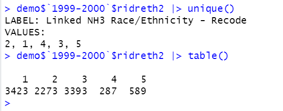

#### dmqmilit

退伍军人/军人身份（17到150岁）

| 代码或值 | 值说明 | 数数 | 累计 |
| :------: | :----: | :--: | :--: |
|    1     |  是的  | 717  | 717  |
|    2     |   不   | 5004 | 5721 |
|    7     |  拒绝  |  5   | 5726 |
|    9     | 不知道 |  5   | 5731 |
|    .     | 丢失的 | 4234 | 9965 |

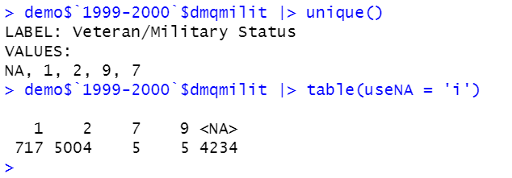

#### dmdborn

出生国家（0-150岁）

| 代码或值 |             值说明             | 数数 | 累计 |
| :------: | :----------------------------: | :--: | :--: |
|    1     | 出生在美国 50 个州或华盛顿特区 | 8069 | 8069 |
|    2     |          出生于墨西哥          | 1146 | 9215 |
|    3     |           出生在别处           | 737  | 9952 |
|    7     |              拒绝              |  1   | 9953 |
|    9     |             不知道             |  1   | 9954 |
|    .     |             丢失的             |  11  | 9965 |

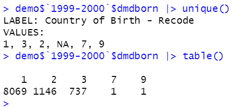

#### indfminc

家庭总收入变量。

在家庭访谈收入部分问卷 (INQ) 中获得有关收入来源的信息后，受访者被要求以美元报告他们自己和其他家庭成员的家庭总收入（问题 INQ200）。如果被访者拒绝回答 INQ200 或不知道家庭总收入，则询问收入筛选问题（问题 INQ220），以查询家庭总收入是否 < $20,000 或 ≥ $20,000。如果受访者回答 INQ220，后续问题要求受访者从打印的手卡上列出的收入范围列表中选择一个收入范围（问题 INQ230）。然后将收入范围的中点用作家庭总收入值。家庭收入值用于计算收入与贫困的比率 (INDFMPIR) 和估计的家庭总收入 (INDHHINC)。家庭总收入在 NHANES 数据文件中报告为一个范围。

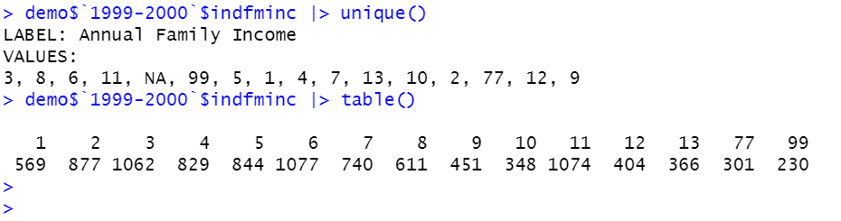


#### indhhinc

家庭收入的另外一种计算方式


#### indfmpir

家庭收入与贫困之比的指数。卫生与公共服务部 (HHS) 的贫困指南被用作计算该指数的贫困指标。这些指南每年在联邦公报中发布，用于确定某些联邦计划的财务资格，例如启蒙计划、补充营养援助计划 (SNAP)（以前的食品券计划）、妇女、婴儿和儿童的特殊补充营养计划(WIC) 和国家学校午餐计划。

变量 INDFMPIR 的计算方法是将家庭收入除以贫困准则，具体取决于家庭规模以及适当的年份和州。如果收入筛选信息（INQ 220：< $20,000 或 ≥ $20,000）是唯一报告的家庭收入信息，则不会计算这些值。如果家庭收入报告为范围值，则使用范围的中点来计算变量。由于披露问题，等于或高于 5.00 的值被编码为 5.00 或更高。如果家庭收入数据缺失，则不会计算这些值。


#### dmdmartl

婚姻状态（**mar**i**t**a**l** status）

婚姻状况变量。收集了 14 岁及以上样本人的婚姻状况数据。在 1999-2000 年数据收集周期的一部分期间，没有询问属于单身家庭的个人的婚姻状况。其中一些人的婚姻状况是从其他涉及其婚姻状况的问卷项目中推算出来的。由于缺乏足够的数据进行插补，566 名 14 岁及以上的样本人的婚姻状况仍然缺失。

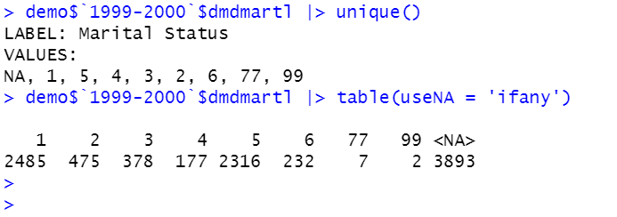


#### ridexprg

8-59 岁女性在检查时的妊娠状态 (ridexprg)。

- 1表示：怀孕
- 2表示：未怀孕
- 3表示：无法确定

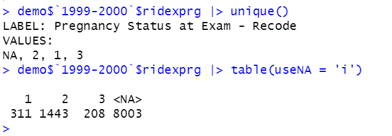

8-59 岁的女性在双能 X 射线吸收仪 (DXA) 检查之前接受了尿妊娠试验。在检查时报告怀孕的人被假定为怀孕；如果尿检呈阴性，但受试者报告他们怀孕，则在检查时仍将状态编码为怀孕 (ridexprg=1)。如果尿妊娠结果为阴性且受访者表示未怀孕，则受访者在检查时编码为未怀孕（ridexprg=2）。仅接受采访的人员的 ridexprg 值 = 3（无法确定）。

#### dmdcitzn

该变量是受访者在美国居住的年数。在美国境外出生的受访者被问及他们来美国停留的月份和年份（DMQ.160）。对问题的回答被重新编码为 9 个类别，范围从不到一年到 50 年或更长。

| 代码或值 |       值说明       | 数数 | 累计 |
| :------: | :----------------: | :--: | :--: |
|    1     | 出生或归化成为公民 | 8663 | 8663 |
|    2     |    不是美国公民    | 1240 | 9903 |
|    7     |        拒绝        |  30  | 9933 |
|    9     |       不知道       |  29  | 9962 |
|    .     |       丢失的       |  3   | 9965 |

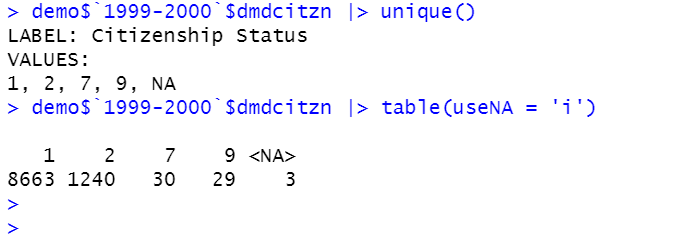


#### dmdyrsus
该变量是受访者在美国居住的年数。在美国境外出生的受访者被问及他们来美国停留的月份和年份（dmq.160）。对问题的回答被重新编码为 9 个类别，范围从不到一年到 50 年或更长。  

| 代码或值 |   值说明    | 数数 |  累计  |
| :------: | :---------: | :--: | :----: |
|    1     |   不到1年   | 116  |  116   |
|    2     | 1年 ~  5 年 | 341  |  457   |
|    3     | 5 年~10 年  | 359  |  816   |
|    4     | 10 年~15 年 | 256  |  1072  |
|    5     | 15 年~20 年 | 156  |  1228  |
|    6     | 20 年~30 年 | 252  |  1480  |
|    7     |  30年~40年  | 174  |  1654  |
|    8     |  40年~50年  | 120  |  1774  |
|    9     |  50年以上   |  63  |  1837  |
|    77    |    拒绝     |  34  | 1871年 |
|    88    |  无法确定   |  1   | 1872年 |
|    99    |   不知道    |  26  | 1898年 |
|    .     |   丢失的    | 8067 |  9965  |

​                                                                                                                                                                    

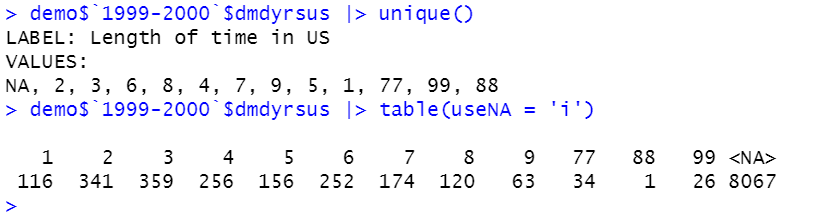


#### dmdhhsiz
该变量是受访者家庭中的人数。此变量的值范围从 1 到 7，其中 7 是用于由 7 个或更多成员组成的家庭的代码。"                                                                                                                                                                                          

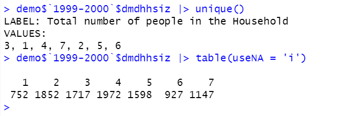

#### 教育

##### dmdeduc

是一个 3 类变量，它将 6 岁及以上的调查参与者分为三个教育程度组之一：

- 1表示：低于高中教育程度
- 2表示：高中毕业生（具有高中文凭或高中同等学历）例如通识教育发展/GED
- 3表示：具有高中以上的教育。

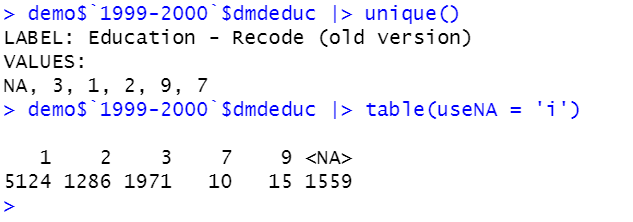

##### dmdeduc3

此变量提供有关 6-19 岁受访者完成的最高年级或教育水平的信息。这些答复由 nchs 记录如下：单年教育（1-12 年级）、高中毕业/ged 和高中后。

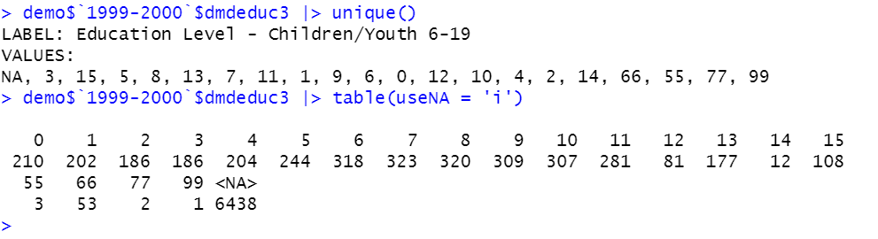

##### dmdeduc2
该变量是 20 岁及以上的成年人完成的最高教育等级或水平。回答类别为：9 年级以下教育、9-11 年级教育（包括 12 年级和无文凭）、高中毕业生/ged、某些大学或副学士 (aa) 学位以及大学毕业生或更高学历。与之前在 nhanes 1999-2000 人口统计文件中发布的类别相比，dmdeduc2 提供了关于成人教育水平的更详细信息。

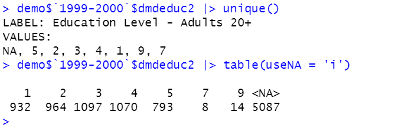

##### dmdhredu

家庭参考人 的教育程度

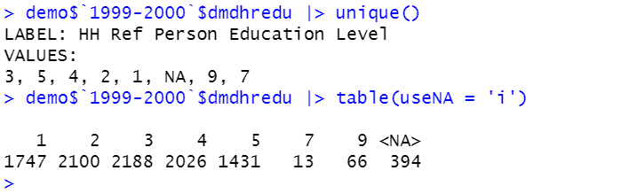

##### dmdhsedu

家庭参考人的配偶的教育程度


#### dmdschol

个变量是学校出勤状态。它要求 6-19 岁的受访者

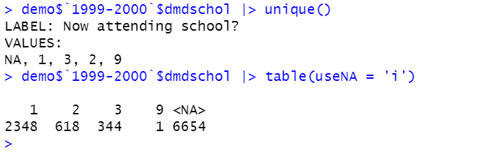


